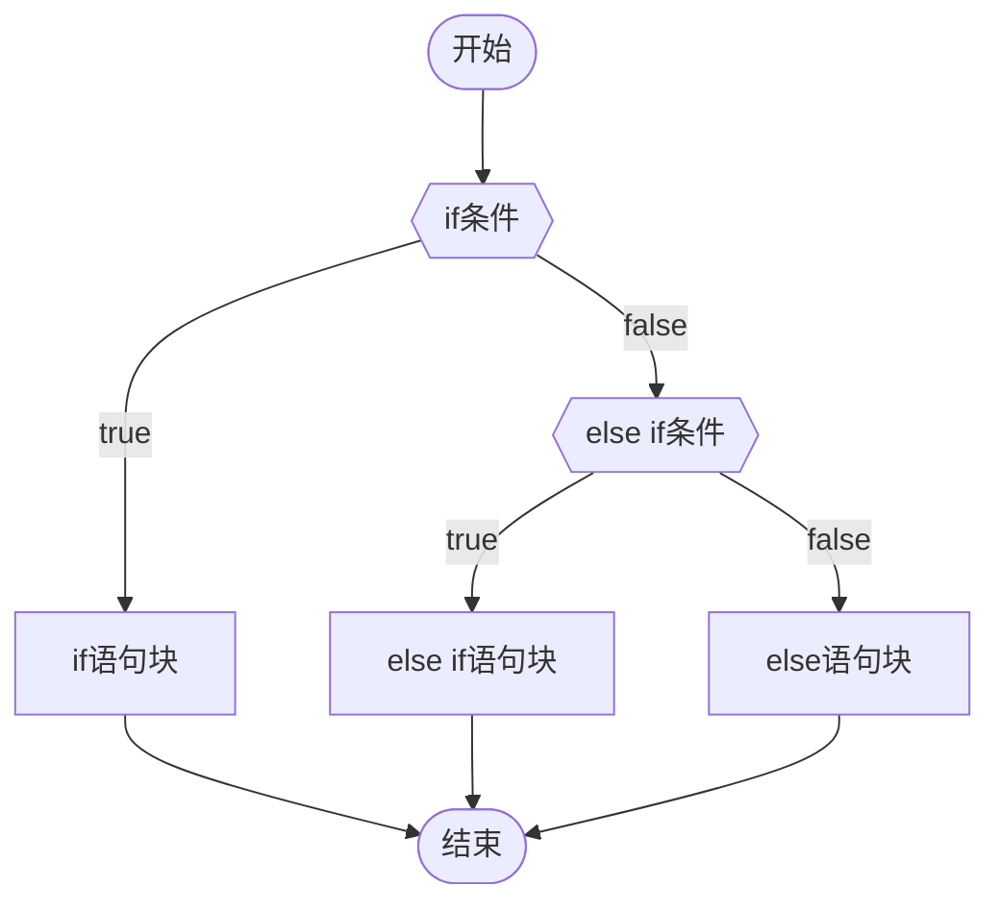

# 一级标题

##  阿萨大大

**asd**
asd

---
1. 1
2. 2
3. 3
4. 4
5. 5
- 1
- as
- asd
`select * from customer`

```html

```

```CSS
```

```CODE
```

```SQL
```

```MYSQL
```

```yml
```

```TEXT
```

```groovy
```

```js
```

```java
```

```jsp

```

```
```txt
```
```
```


```
asd
```
```sql
123
```

==asd==

==阿萨大大==



[Markdown超级教程 Obsidian版 - 成双酱的小屋 - Obsidian Publish](https://publish.obsidian.md/csj-obsidian/0+-+Obsidian/Markdown/Markdown%E8%B6%85%E7%BA%A7%E6%95%99%E7%A8%8B+Obsidian%E7%89%88)
